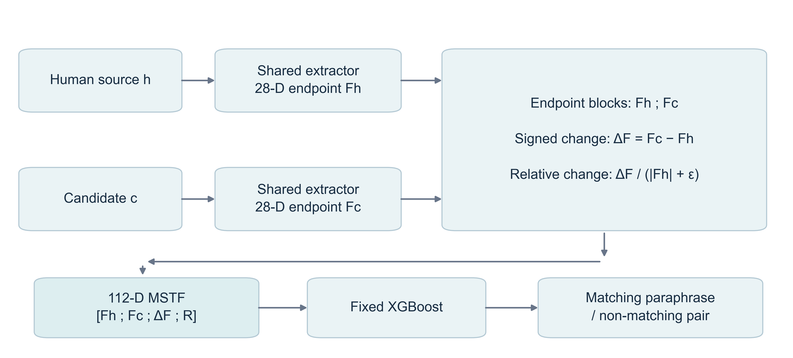

# LPcode / MSTF: leakage-safe paired provenance detection

## Overview

Research software and frozen evidence for **Multi-view coding-style transitions for leakage-safe paired detection of LLM-paraphrased code**, by Jin Huang, Qiao Li and Qisen Gao. The input is a **human source–candidate pair**; the task is to classify its labelled paraphrase relationship. This is not a standalone, candidate-only AI-code detector, a semantic-equivalence test or proof of historical provenance.

The [public repository](https://github.com/cdhuangjin/lpcode-mstf-leakage-safe-detection) has an existing v1.0.1 release. This hardening revision adds audit and reviewer reproduction tools; it does not assert a new tagged version, accepted publication or DOI. Start with saved-result reproduction below, or read the complete [reproducibility guide](reproducibility.md) and [final audit](FINAL_REPRODUCIBILITY_AUDIT.md).

## Paper task

MSTF combines human and candidate endpoint descriptors, signed differences and relative changes. The full representation has 112 dimensions from 28 measurements per endpoint. Evaluation separates source-origin components before constructing partition-local negative pairs and studies strict clean, held-out generator, transformed candidate and held-out language settings. Exact-code isolation does not establish semantic deduplication.



## Repository structure

| Path | Purpose |
| --- | --- |
| `repro/2502.17749/v1/lpcode_v1/` | Features, pairing, representations, classifiers, Gate A–D and A0–A5 runners |
| `repro/2502.17749/v1/tests/`, `tests/` | Research and release/audit tests |
| `scripts/` | Data acquisition, verification, reproduction and isolation audit |
| `results/` | Frozen configurations, ledgers, summaries, manuscript and figure sources |
| `repro/2502.17749/v1/results/04_cross_language/` | Frozen Gate D evidence |
| `audit/` | Audit evidence, historical source archives and separate recomputation outputs |
| `tools/`, `docs/` | Figure tools and detailed contracts/data dictionaries |
| `FILE_MANIFEST.json`, `SOURCE_INVENTORY.json` | Release file hashes and source provenance |

No model checkpoint, generated feature cache or raw LPcode dataset is distributed. There is no root-level `src/` package or pretrained prediction service.

## Requirements

Use Git and **Python 3.11**, with the pinned [requirements.txt](requirements.txt). CPU execution is sufficient; no GPU or paid API is required. Windows/Python 3.11 is the validated platform. Linux/macOS activation syntax is supplied for convenience, without a claim of tested platform equivalence. The historical `uv.lock` is retained as provenance and is not the canonical installation contract.

## Installation

Run from the repository root using a Python 3.11 interpreter (`py -3.11` on Windows if necessary):

```bash
python -m venv .venv
# Windows PowerShell:
.venv\Scripts\Activate.ps1
# Linux/macOS instead: source .venv/bin/activate
python -m pip install -r requirements.txt
python -m pip install --no-deps -e repro/2502.17749/v1
python --version
```

Confirm the final command reports Python 3.11 before running the workflows.

## Original data and integrity

```bash
python scripts/fetch_upstream.py
```

This obtains [LPcode from its owner](https://github.com/Shinwoo-Park/LPcode) at commit `b3660c8262ae57e14498528119607ee673d4257a`, under `repro/2502.17749/code`. Raw Task 1 data are `experiment/task1/dataset/{c,cpp,java,py}.jsonl`. No upstream open licence was identified in the recorded release check, so raw snippets and original upstream program bodies are not bundled or relicensed. Consult [data access](docs/DATA_ACCESS.md), [dataset checksums](docs/UPSTREAM_CHECKSUMS.json) and [third-party notices](THIRD_PARTY_NOTICES.md).

The helper refuses to replace an existing checkout at another revision and stages deposited baseline metric files only when absent or identical. It is acquisition, not a full dataset-integrity audit. The `audit` and `smoke` modes verify pinned raw-data bindings; saved-result modes hash-check their frozen inputs without raw data.

## Quick start

```bash
python scripts/quickstart.py
python scripts/verify_release.py
python scripts/reproduce.py --mode all-saved
```

The first command illustrates representations with synthetic endpoint vectors; it does not create research results. The second verifies frozen evidence; the third regenerates numerical tables and figure CSVs without fitting models. None requires raw LPcode data.

## Reproduce saved results

```bash
python scripts/reproduce.py --mode table2
python scripts/reproduce.py --mode table3
python scripts/reproduce.py --mode all-saved
```

Means, paired differences, transformation drops and applicable sample SD are recomputed from frozen row ledgers. Confidence intervals are retained from hash-verified summaries after consistency checks; these commands do not rerun the bootstrap. Mechanism importance remains frozen aggregate data, checked against a second aggregate source; no importance refit or per-fold importance reconstruction is claimed.

F1 is positive-class F1 averaged equally across evaluation cells, not F1 macro-averaged over class labels. Differences below are percentage points.

| Gate / comparison | Baseline F1 | Method F1 | Difference |
| --- | ---: | ---: | ---: |
| A: strict clean; A1 vs A0, fixed XGBoost | .9149 | .9317 | +1.683 pp |
| B: held-out generator; full MSTF vs original LPcode MLP | .8915 | .9671 | +7.563 pp |
| C: combined transformation; full MSTF vs original LPcode MLP | .8415 | .9531 | +11.160 pp |
| D: held-out language; full MSTF vs original LPcode MLP | .8938 | .9652 | +7.141 pp |

The comparators differ across gates; this is not a transition-by-shift interaction estimate. A5−A4 is −0.019 pp on clean data and +0.007 pp for held-out generators. These near-null or negative increments are retained. Only three seed clusters support intervals; Gate D is descriptive. See [statistical scope](docs/STATISTICS.md).

## Run a real smoke fit

After fetching upstream:

```bash
python scripts/reproduce.py --mode smoke
```

This fits actual A0 and A1 models for C, seed 42, fold 0 of five grouped folds, using the first ten fixed measurements. A0 has 20 dimensions; A1 has 30. Both use fixed XGBoost (300 estimators, depth 4, learning rate .05, subsample .8, column subsample .8, one job), with `StandardScaler` fitted on training data only. Measured local smoke F1 values were .8965517 and .9186207; these single-fold scores are not the published means. Complete pair records, configuration, environment, metrics and hashes are saved separately.

## Run Gate A–D and A0–A5

Full formal training was not rerun in this submission audit. The [formal-run instructions](reproducibility.md#full-training-boundary-and-runner-map) describe prerequisite baseline evidence, preceding Gate PASS artifacts, canonical paths and an isolated rerun checkout. They are not a one-command guarantee of historical replication.

The ablation entry point, **only after those prerequisites in the isolated rerun tree**, is:

```bash
python -m lpcode_v1.ablation run --registry results/06_paper_assets/frozen_result_registry.json --output-root results/05_mechanism_analysis
```

| Variant | Endpoint measurements | Representation | Dimensions |
| --- | --- | --- | ---: |
| A0 | Original 10 | Endpoints | 20 |
| A1 | Original 10 | Endpoints + signed difference | 30 |
| A2 | Enhanced 28 | Endpoints | 56 |
| A3 | Enhanced 28 | Signed difference only | 28 |
| A4 | Enhanced 28 | Endpoints + signed difference | 84 |
| A5 | Enhanced 28 | Endpoints + signed + relative differences | 112 |

## Pairing and leakage audit

```bash
python scripts/reproduce.py --mode audit
```

With pinned upstream available, this reruns the manuscript-evidence audit and reconstructs raw-data pairs, reusing or building validated feature caches without model fitting. The recorded audit binds all 2,928 Gate A–D records and 1,800 ablation records to reconstructed pairs, with zero origin/exact-code train–test overlap; the 1,440 Gate C records also pass the transformed-code overlap check. Gate D origin identifiers are language-scoped, while exact-code hashes are compared globally across languages; this does not establish global semantic program identity. See [pipeline and historical source limits](reproducibility.md#pipeline-and-pair-construction). Matching pair digests proves the audited default pairing contract, not a rerun of historical model training.

## Tables

`all-saved` writes Tables 2–7 as CSV and Markdown. `table2` and `table3` select those individual tables. [The source map](reproducibility.md#table-and-figure-source-map) identifies each frozen ledger and summary. Table 1 describes the feature contract and is not a fitted-results table regenerated by this CLI.

## Figures

`all-saved` writes eight source CSVs: `figure_main`, `figure_variants`, `figure_contrasts`, `figure_transformations`, `figure_generator`, `figure_language`, `figure_negative` and `figure_mechanism`. It does not render publication images. To render the five revised figures from their existing frozen sources:

```bash
python tools/revision_figures.py
```

This rendering command writes revised figure artifacts and public QA outputs at its documented paths, unlike the isolated reproduction CLI. Its public geometry check is narrower than the author's archived publication QA. No private Codex skill is needed. Office manuscript typesetting has additional author-side template/tool requirements and is not part of numerical reproduction.

## External validation

The reproducibility gate passed. The subsequent CodeMirage eligibility audit found insufficient public source/paraphrase provenance for the frozen paired task. Gate E is BLOCKED and was not run; no external scores or generalization claim are included. See the [external validation report](CODEMIRAGE_EXTERNAL_VALIDATION.md), [paper update plan](PAPER_UPDATE_PLAN.md) and [next decision](NEXT_DECISION.md). Metadata probes are recorded separately from any corpus acquisition or training.

## Outputs and integrity scope

The reproduction CLI confines run artifacts to a child of `audit/recomputed/`: for example, the first `all-saved` run uses `audit/recomputed/all-saved/`. If it exists, the command selects `all-saved-001/`, then `-002/`, and so on; it never replaces an earlier run. `--output audit/recomputed/my-run` follows the same rule. Feature caches used by audit/smoke reside under `audit/cache/`.

Every run writes `report.json` and `artifact_hashes.json`; saved modes add `provenance.json` and requested CSV/Markdown files. SHA-256 covers all files in that run directory except `artifact_hashes.json` itself. Runtime/environment fields may differ across runs, so whole-directory byte equality is not a metric-equivalence criterion. See [formats and provenance](reproducibility.md#outputs-formats-and-hash-scope).

## Runtime and validation scope

Measured local CLI times with existing caches were smoke 2.576 s, audit 56.343 s, Table 2 .133 s, Table 3 .129 s and all-saved .179 s. These are observations on the validation machine, not fresh-install benchmarks. Building four-language features and transformation caches takes minutes; exact uncached time and peak memory were not benchmarked. Task 1 raw files total approximately 142 MiB; allow several GB for dependencies, upstream duplicates, caches and outputs. No full-training runtime estimate is asserted.

The current local validation completed **481 tests passed** (19 warnings, 109.32 s), recorded in [audit/hardened_tests.xml](audit/hardened_tests.xml). This is the current audit branch's result, not a claim about the earlier public v1.0.1 test suite.

```bash
python scripts/fetch_upstream.py
python -m pytest tests -q
python -m pytest repro/2502.17749/v1/tests -q
```

Both suites require fetched upstream: the release/audit suite includes an actual C smoke fit. They can also be run together with `python -m pytest tests repro/2502.17749/v1/tests -q` after acquisition.

Saved verification, raw pairing reconstruction, a one-fold fit and full formal retraining are distinct validation levels.

## Determinism

Formal seeds are 42, 123 and 2024; applicable grouped protocols use five folds (Gate D does not). Origin components use deterministic hash tie-breaking and negatives use partition-local cross-component cyclic derangement. Frozen intervals use 10,000 seed-cluster bootstrap replicates with RNG seed 250217749. Relative differences use epsilon `1e-8`. Current `t3.py` differs from the historical files: [two exact recovered archives](audit/historical_sources/README.md) preserve those bindings. Do not resume historical ledgers with changed source contracts.

## Licensing and data availability

MIT covers the authors' new software only, as scoped in [LICENSE_SCOPE.md](LICENSE_SCOPE.md) and [LICENSE](LICENSE). Inherited LPcode measurements, third-party software, raw snippets, saved results, figures and manuscript materials are excluded. [DATA_LICENSE.md](DATA_LICENSE.md) grants no additional open-reuse licence for non-software evidence; public availability does not imply CC BY or upstream permission.

Raw data are obtained from pinned upstream LPcode and are not redistributed here because no open licence was identified. Frozen metrics and figure sources are available for public inspection in the project repository, without an additional open-data reuse grant. 原始数据请从固定版本的 LPcode 上游获取；本项目不再分发原始代码片段。公开的指标和绘图源数据不附加开放复用许可，MIT 仅适用于作者新增的软件。

## Citation

Use [CITATION.cff](CITATION.cff) for this software/evidence release, and cite the original LPcode work and dataset independently. The [main manuscript](results/07_manuscript/LPcode_MSTF_Wiley_Revised.pdf), [supplement](results/07_manuscript/LPcode_MSTF_Supplementary.pdf) and [RIS bibliography](references.ris) accompany the evidence. The work is a manuscript; no acceptance, invented DOI or DOI-backed preservation deposit is claimed.
